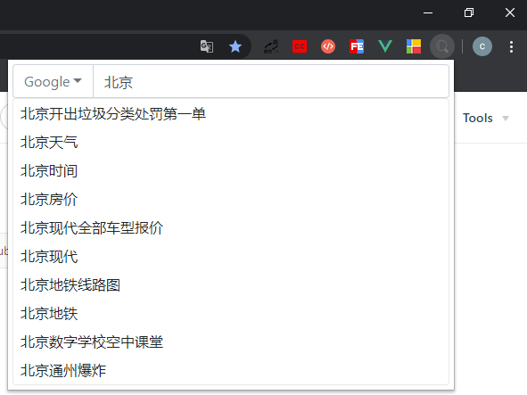
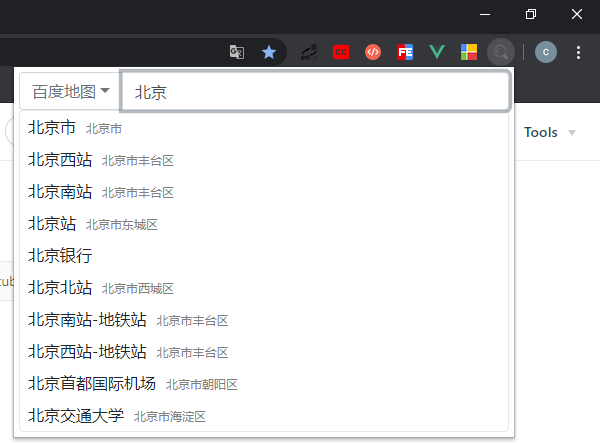
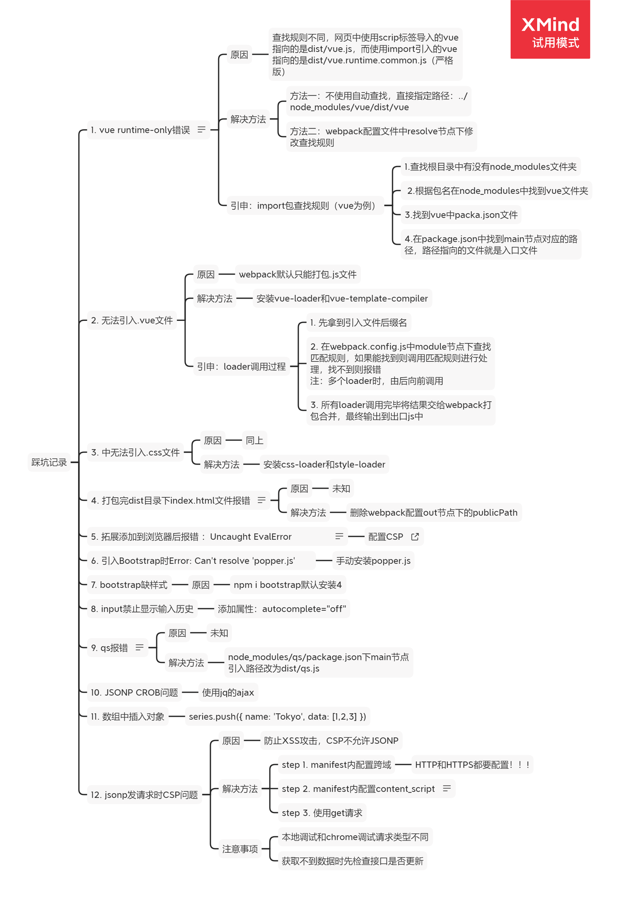

# QuickSearch v1.01
### 简介
基于Vue.js开发的chrome快速搜索功能扩展，内置Google、百度、地图、淘宝、B站、知乎、微信等多个搜索引擎。多种操作方式，自动控制焦点，全程无需鼠标，纯键盘控制切换引擎、搜索、选择联想内容并根据搜索引擎不同给出不同联想内容。
### 更新日志
版本号：v1.01
+ 修复vue实例中el绑定的元素id="app"情况下访问页面内有id="app"的元素的网站时内容被扩展替换的bug
### 技术栈
+ Vue.js
+ webpack
+ Jquery
+ Bootstrap
### 使用
+ 唤醒扩展
    + Windows：快捷键Ctrl+B
    + MacOS：快捷键MacCtrl+B
    + 点击右上方扩展图标
+ 切换搜索引擎
    + 按Tab键打开下拉列表，然后按数字键选择需要的引擎，或者使用 ↑  ↓ 键选中按回车选择 
    + 鼠标点击左侧按钮
+ 搜索
    + 输入完毕后按Enter键搜索
    + 根据联想内容使用 ↑  ↓ 键键或鼠标点击搜索
+ 关闭扩展
    + 按下ESC键
    + 点击页面空白处
### 安装
+ 下载“谷歌快速搜索插件”压缩文件
+ 解压后Chrome开发者模式下加载dist目录
### 演示

### 踩坑记录

### 建议&反馈
846088113@qq.com 谢谢 : ）